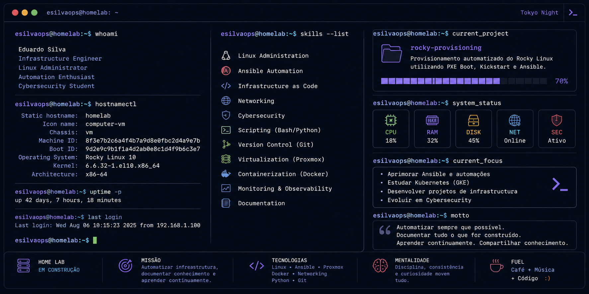

  

<h1 align="center">Olá! Eu sou o Eduardo Silva 👋</h1>

Infraestrutura • Linux • Automação • DevOps • Cybersecurity

> *"Automatizando infraestrutura, documentando conhecimento e aprendendo continuamente."*

---

Atualmente estou construindo um laboratório de infraestrutura inspirado em ambientes corporativos, onde estudo, documento e automatizo soluções utilizando tecnologias Open Source.

Meu objetivo é desenvolver projetos reais, reproduzíveis e bem documentados, focados em Linux, Automação, Redes e Segurança da Informação.

---

# 🚀 Sobre mim

Sou apaixonado por tecnologia e acredito que infraestrutura bem planejada deve ser automatizada, documentada e fácil de reproduzir.

Hoje concentro meus estudos principalmente em:

* 🐧 Administração de sistemas Linux
* ⚙️ Automação com Ansible
* 🏗️ Infraestrutura
* 🌐 Redes
* 🔒 Segurança da Informação
* ☁️ Virtualização com Proxmox VE

Meu foco é transformar conhecimento em projetos práticos que possam servir como portfólio e também como material de estudo para outras pessoas.

---

# 🛠️ Tecnologias

## Sistemas Operacionais

* Rocky Linux
* Fedora
* Ubuntu
* Windows Server

## Infraestrutura

* Proxmox VE
* Active Directory
* Docker
* NetBox
* pfSense

## Automação

* Ansible
* Bash
* Git
* GitHub

## Atualmente estudando

* Kubernetes
* Python
* Terraform
* Grafana
* Prometheus
* Wazuh
* Greenbone/OpenVAS

---

# 📂 Projetos em destaque

## 🚀 Rocky Provisioning

Provisionamento automatizado do Rocky Linux utilizando:

* PXE Boot
* Kickstart
* Ansible

Objetivos do projeto:

* Zero Touch Provisioning
* Provisionamento reproduzível
* Configuração automática
* Hardening
* Documentação completa

---

## 🏠 Home Lab

Meu laboratório pessoal é onde desenvolvo praticamente todos os estudos.

Ele será composto por ambientes como:

* Windows Server
* Active Directory
* Linux Servers
* Docker
* Wazuh
* NetBox
* Greenbone
* Kubernetes

Tudo executado sobre Proxmox VE.

---

# 🎯 Objetivos para 2026

* Construir um Home Lab completo
* Dominar Ansible
* Evoluir em Linux Administration
* Aprender Kubernetes
* Desenvolver projetos de Infrastructure as Code
* Aprimorar conhecimentos em Cybersecurity

---

# 📖 Filosofia

> **Automatizar sempre que possível.**

> **Documentar tudo o que for construído.**

> **Aprender continuamente.**

> **Compartilhar conhecimento.**

---

# 📊 Estatísticas

---

# 📫 Contato

* GitHub: **@esilvaops**

*(Em breve também disponível em inglês 🇺🇸.)*
